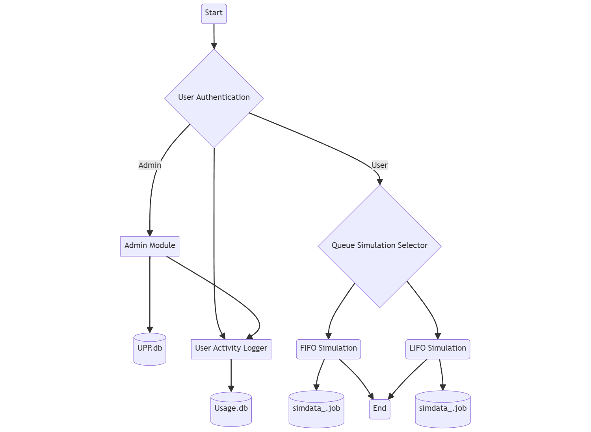
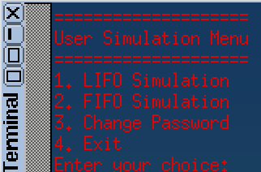

# Queue Simulator - 908068.tgz

After reviewing the assignment document, a quick draw up of the design using [Mermaid](https://mermaid-js.github.io/mermaid/#/) was done.

## Dependencies



## Menu

The main '`./menu.sh` script is the entry point for the system. It ensures the system has the required dependency jq, a JSON binary for manipulating JSON, and that the scripts are executable. It also sources the `library.sh` script which contains commonly used functions used by the system.

```sh
#!/bin/ash

# Performs installation and executability of dependencies
chmod +x ./*.sh
chmod +x ./queue_scripts/*.sh
./dependencies.sh
# shellcheck disable=SC1091
. ./library.sh
```

The user is then authenticated by reading the username and password which is parsed forward to the `auth.sh` script. jq is used to read the `UPP.json` file and check this, and the role, which decides via a case statement which menu to display.

```sh
# If the user exists, check the role and password
if [ -n "$user_info" ]; then
    role=$(echo "$user_info" | jq -r '.role')
    password=$(echo "$user_info" | jq -r '.password')

    if [ "$2" = "$password" ]; then
        if [ "$role" -eq 0 ]; then
            exit 0
        elif [ "$role" -eq 1 ]; then
            exit 1
        fi
    else
        exit 13
    fi
else
    exit 13
fi
```

A function of the user is to change their password, which is performed by the `user_change_password` function. This function reads the new password and confirms it, then checks the pin before updating the password in the `UPP.json` file.

```sh
user_change_password() {
    while true; do
        newPassword=$(read_exit_check "Enter a new password: ")
        confirmPassword=$(read_exit_check "Confirm new password: ")
        if [ "$newPassword" = "$confirmPassword" ] && validatePassword "$newPassword"; then
            break
        else
            echo "Passwords do not match or are invalid. Please enter a valid password (5 alphanumeric characters)."
        fi
    done

    user_data=$(retrieve_user_data)
    user_pin=$(echo "$user_data" | jq -r ".users.\"$username\".pin")

    pin=$(read_exit_check "Enter your pin: ")
    if [ "$pin" = "$user_pin" ]; then
        updated_username_data=$(echo "$user_data" | jq \
            --arg username "$username" \
            --arg password "$newPassword" \
            '.users[$username].password = $password')

        echo "$updated_username_data" >./data/UPP.json
    else
        echo "Incorrect pin."
    fi
}
```

The `handle_exit` function is used to log the user out and log their session. It calculates the time difference between the login and logout times and logs this to the `Usage.db` file. Furthermore, it handles ungraceful exits by catching the `INT` and `TERM` signals from say a `Ctrl+C` or `kill` command.

```sh
# Logs user out and logs their session
handle_exit() {
    exit_time=$(date +%s)
    time_diff=$((exit_time - login_time))
    user_logger "$username" "Session: $login_time,$exit_time,$time_diff"
    loading
    echo "Bye!"
    exit 0
}

# Catches ungraceful exits
trap handle_exit INT TERM
```

In Tinycore, the `rxvt` terminal supports ANSI colours, however the `ash` shell doesn't support -e on echo so no escape sequence is possible. Instead, the `printf` command is used to print the ANSI colour codes as its POSIX compliant.

```sh
# ANSI colours
RED='\033[0;31m'
NC='\033[0m'

printf "${RED}"
```

<center>



</center>

## Library

The `library.sh` script contains commonly used functions used by the system. The `read_exit_check` function reads the user input and checks if the user wants to exit the system by typing `bye`.

```sh
read_exit_check() {
    message="$1"
    read -r -p "$message" REPLY
    if [ "$(echo "$REPLY" | tr '[:upper:]' '[:lower:]')" = "bye" ]; then
        read -r -p "Are you sure you want to exit? (y/n) " REPLY
        if [ "$(echo "$REPLY" | tr '[:upper:]' '[:lower:]')" = "y" ]; then
            kill -s TERM $$ # Exit the script forcefully
        else
            echo "Cancelled"
        fi
    else
        echo "$REPLY"
    fi
}
```

It contains the validation, logging and loading animation as well as a retrieval system for user info.

```sh
loading() {
    i=1
    while [ "$i" -le 5 ]; do
        echo -n ". "
        sleep 0.5
        i=$((i + 1))
    done
    echo ""
}
```

## Admin_tools

The `admin_tools.sh` script contains the functions to `create_user`, `delete_user`, `update_user` and so on.

The `delete_user` function reads the username with `jq` and checks if the user exists. If the user exists, it deletes the user from the `UPP.json` file after receiving valid pin input.

```sh
delete_user() {
    user=$1
    username=$(read_exit_check "Enter a username: ")
    if ! check_user_exists "$username"; then
        updated_user_data=$(echo "$user_data" | jq "del(.users.\"$username\")")
        pin=$(read_exit_check "Enter your pin: ")
        if [ "$pin" = "$(get_username_data "$1" | jq -r '.pin')" ]; then
            echo "$updated_user_data" >./data/UPP.json
        else
            echo "Invalid pin."
        fi
    else
        echo "User does not exist."
    fi
    read -p "Press [Enter] key to continue..." readEnterKey
}
```

The `update_user` function contains loops in order to fully update the user's details. It reads the username it rewrites the JSON and updates the `UPP.json` file.

```sh
update_user() {
    user=$1
    username=$(read_exit_check "Enter a username: ")
    if ! check_user_exists "$username"; then
        while true; do
            newPassword=$(read_exit_check "Enter a new password: ")
            confirmPassword=$(read_exit_check "Confirm new password: ")
            if [ "$newPassword" = "$confirmPassword" ] && validatePassword "$newPassword"; then
                break
            else
                echo "Passwords do not match or are invalid. Please enter a valid password (5 alphanumeric characters)."
            fi
        done

        while true; do
            newPin=$(read_exit_check "Enter a new pin: ")
            if validatePin "$newPin"; then
                break
            else
                echo "Enter a valid pin (3 digits)."
            fi
        done

        pin=$(read_exit_check "Enter your pin: ")
        if [ "$pin" = "$(get_username_data "$user" | jq -r '.pin')" ]; then

            updated_username_data=$(echo "$user_data" | jq \
                --arg username "$username" \
                --arg password "$newPassword" \
                --arg pin "$newPin" \
                '.users[$username].password = $password | .users[$username].pin = $pin')

            echo "$updated_username_data" >./data/UPP.json
        else
            echo "Invalid pin."
        fi
    else
        echo "User does not exist."
    fi
    read -p "Press [Enter] key to continue..." readEnterKey
}
```

## Fifo Simulator

The `fifo_simulator.sh` script contains the functions to `enqueue`, `dequeue`, `display` and so on.

The script will check if the pre-defined config is available, and if it's empty. If it is, it will prompt the user to enter byte tasks. If the user enters `y` it will read the file, if not it will prompt the user to enter the tasks which are saved for future use.

```sh
input=""

if [ "$REPLY" = "y" ]; then
    input=$(cat ./data/users/simdata_"$1".job)
    if [ -z "$input" ]; then
        echo "No pre-defined input found"
        read -r -p "Enter 10 Byte tasks (comma seperated): " input
        echo "$input" >./data/users/simdata_"$1".job
    fi
else
    read -r -p "Enter 10 Byte tasks (comma seperated): " input
    echo "$input" >./data/users/simdata_"$1".job
fi
```

The `ash` shell is quite limiting in its abilities to have a fully fledged queue system. This is because it doesn't have arrays, or associative arrays, objects, etc. String manipulation is used to have a "simular" effect because FIFO/LIFO is relatively simple concept.

The `enqueue` function is parsed a byte from the input after looping over the string with the `IFS` set to a comma. If the queue is empty, the byte is added to the queue, otherwise it is appended to the queue.

```sh
# Add a byte to the queue
enqueue() {
    local byte=$1
    if [ -z "$queue" ]; then
        queue="$byte"
    else
        queue="$queue $byte"
    fi
}

# Loop over string splitting and enqueueing each byte
IFS=','
for byte in $input; do
    sleep 1
    clear
    printf "Enqueueing ${GREEN}${byte}${NC}"
    enqueue "$byte"
    echo
    echo "\nFIFO Queue is now: ${queue}"
done
```

The `dequeue` function in FIFO removes the first byte from the queue string. Grep is used to check if the queue contains a space, if it does, the first element is removed, otherwise the queue is set to an empty string.

```sh
# Takes the first element off the queue
dequeue() {
    # Check if queue contains a space
    if echo "$queue" | grep -q ' '; then
        # If queue contains a space, remove the first element
        queue=$(echo "$queue" | cut -d' ' -f2-)
    else
        # If queue doesn't contain a space, set it to an empty string
        queue=""
    fi
}
```

## Lifo Simulator

The `lifo_simulator.sh` script contains the functions to `push` and `pop` which allow appending and removing bytes from the stack respectively.

The `push` function appends a byte to the stack. If the stack is empty, the byte becomes the current stack, otherwise it is appended to the stack.

```sh
push() {
    local byte=$1
    if [ -z "$queue" ]; then
        queue="$byte"
    else
        queue="$queue $byte"
    fi
}
```

The `pop` function removes the last byte from the stack. Grep is used to check if the stack contains a space, if it does, the last element is removed, otherwise the stack is set to an empty string. This `${queue% *}` parameter expansion is used for example: if `queue="item1 item2 item3"`, then `${queue% *}` will result in `item1 item2`, removing item3 from the queue. On the last item, the queue is set to an empty string because there is no space to leading the string.

```sh
pop() {
    # Check if queue contains a space
    if echo "$queue" | grep -q ' '; then
        # If queue contains a space, remove the last element
        queue="${queue% *}"
    else
        # If queue doesn't contain a space, set it to an empty string
        queue=""
    fi
}
```

## Admin Usage Tools

`total_time_by_user`, from the `admin_usage_tools.sh` script will read a username and count the 4th element of the line by the `,` separator if the line contains the username and Session action. This contains the total time in seconds for that session, so this function calculates the total session time for a user.

```sh
# Calculate total time by user
total_time_by_user() {
    user=$1
    local time=0
    while IFS= read -r line; do
        if echo "$line" | grep -q "User: $user, Action: Session:"; then
            time="$((time + $(echo "$line" | cut -d',' -f4)))"
        fi
    done <./data/Usage.db
    echo "$time" Total seconds by "$user"
}
```

The `most_popular_sim_by_user` function reads the `Usage.db` file and counts the number of times a user used the LIFO and FIFO simulators. It then compares the two counts and outputs the result.

```sh
most_popular_sim_by_user() {
    lifo=0
    fifo=0
    user=$1
    while IFS= read -r line || [ -n "$line" ]; do
        if echo "$line" | grep -q "User: $user, Action: lifo"; then
            lifo=$((lifo + 1))
        elif echo "$line" | grep -q "User: $user, Action: fifo"; then
            fifo=$((fifo + 1))
        fi
    done <./data/Usage.db

    if [ $lifo -gt $fifo ]; then
        echo "$user used LIFO the most at $lifo times"
    elif [ $lifo -lt $fifo ]; then
        echo "$user used FIFO the most at $fifo times"
    else
        echo "$user had the same usage for both simulators"
    fi
}
```

The `ranking_list` function reads the `UPP.json` file and gathers all existing unique users. It then calls the `total_time_by_user` function for each user and appends the result to a temporary file. A literal newline as ash IFS doesn't support the escape sequence `\n` for newlines. The temporary file is then sorted by the first column in descending order and removed.

sort is used:

-n for numerical sort with lines leading with numbers (we put total time there)
-r for reverse order
-k1 for the first column

```sh
# Ranks users by total time given the leading column (number of seconds), descending
ranking_list() {
    tmp_file=$(mktemp)
    IFS='
' # set the Internal Field Separator to literal newline
    for user in $(jq -r '.users | keys[]' ./data/UPP.json); do
        total_time_by_user "$user" >>"$tmp_file"
    done

    sort -nr -k1 "$tmp_file"

    rm "$tmp_file"
}
```

## Bibliography

Dolan, S. (2023) jq, JQ. Available at: https://jqlang.github.io/jq/ (Accessed: 20 March 2024).
Sveidqvist , K. (no date) Mermaid. Available at: https://mermaid.js.org/ (Accessed: 25 February 2024).
